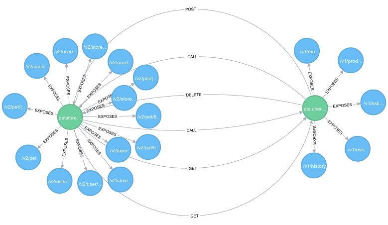

### About
---
Vacuum is a REST API which allows you to understand the dependency graph of your microservices architecture.

It is based on [Swagger.io](http://swagger.io/), you can just submit the URL of your swagger documentation
and Vacuum will parse it and create the Service-Endpoint graph as you can see in the image bellow.




The *green* node is the service host name, captured from Swagger document, it represents the main node and is labeled as `Service`.
*Blue* nodes are the service paths, also captured from Swagger spec, the nodes labeled as `Endpoint` and have the propety `path`
which descrives its path on that service. Basically, the graph is composed by host names and paths. 

There is only one relationship between `Service` and `Endpoint` which is identified by the label `EXPOSES`. It represents all
endpoints that are exposed for a given service swagger spec.

Once you have created the Service-Endpoint graph you can adjust your microservices to send a request
to Vacuum API.

The request needs to inform the details about the call that your service A is sending to your service B.
After that, Vacuum will create relationships between both services considering the path and http method in use.

The relatioship between the Service rely on a request event with these details:
- origin_host: The service A host name which is firing the call to service B
- method: The HTTP method
- target_host: The service B host name
- target_path: The endpoint that service A is calling from service B

### Requirements:
---

- [JDK8](http://www.oracle.com/technetwork/java/javase/downloads/jdk8-downloads-2133151.html)
- [Neo4j Community 3.0.1](http://neo4j.com/download/)


### Basic Usage 
---

#### Creating a Service-Endpoint graph based on a Swagger URL
```
POST <host>:8090/v1/microservices -H 'Content-Type: application/json' -d '{"swagger_url": "<the_swagger_url>"}'
```

#### Registering a call from service A to service B
```
POST <host>:8090/v1/requests -H 'Content-Type: application/json' -d '{"origin_host": "api.uber.com", "method": "POST", "target_host": "petstore.swagger.io", "target_path": "/v2/user/login"}'
```

#### Registering another call from service A to service B
```
POST <host>:8090/v1/requests -H 'Content-Type: application/json' -d '{"origin_host": "api.uber.com", "method": "DELETE", "target_host": "petstore.swagger.io", "target_path": "/v2/pet"}'
```

### Sample Data
---
Under `scripts` folder you will find the script `fetch_db.sh`, it will provide some sample data to populate Neo4J.
It creates two graphs Service-Endpoint and add relatioships (`GET`,`POST`,`DELETE`,`CALL`) for `Service` nodes which represents call events between them.

After you have executed the script you can open the Neo4J dashboard http://localhost:7474/browser/
and execute this Cypher query to see all the entire graph: `MATCH p=()-[r:EXPOSES]->() RETURN p` 

### Basic Queries via Vacuum API
---

#### Get all microservice which contains term `user` in ther endpoints:
```
GET <host>:8090/v1/microservices?path_term=user -H 'Content-Type: application/json'
```

#### Get all services which rely on service id
```
GET <host>:8090/v1/microservices/b36e8649-e82e-4795-8ef6-c2d8eb3e6620/dependants -H 'Content-Type: application/json'
```
The service id is generate and returned when you send a `POST /v1/microservices` with `swagger_url` as body param or you can checkout the `uuid` param on Neo4j dashboard if you have executed the `fetch_db.sh`.


### TODO
---
- New queries
- Document Vacuum API with Swagger.io
- Authentication (API, Neo4J)
- Unit & IT Tests
- Improve DDD
- Better DOCs
